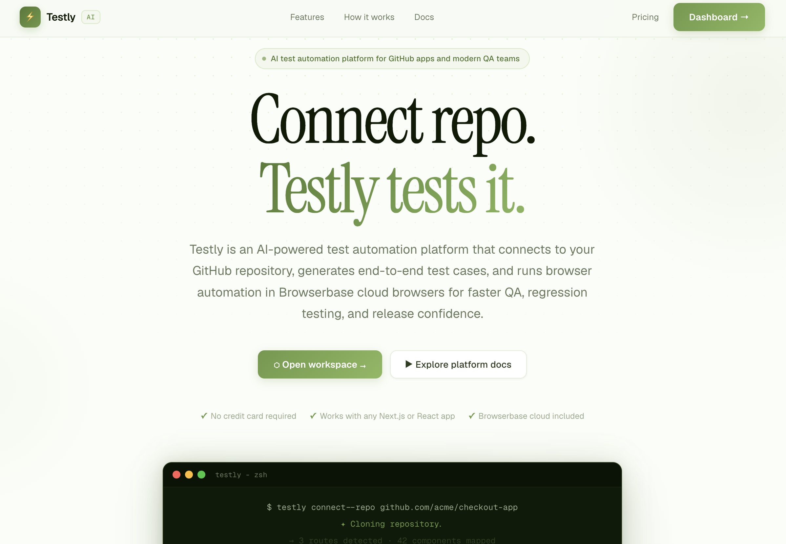
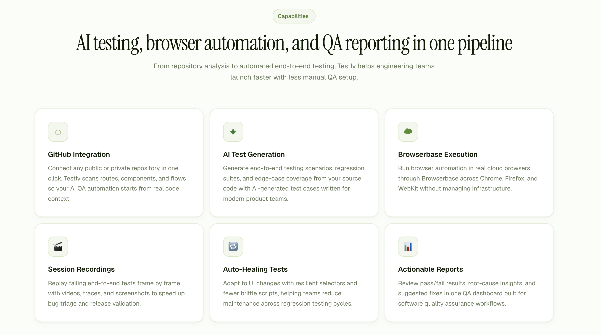
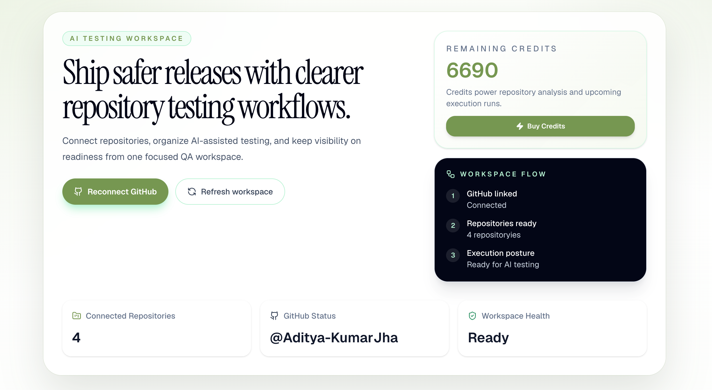
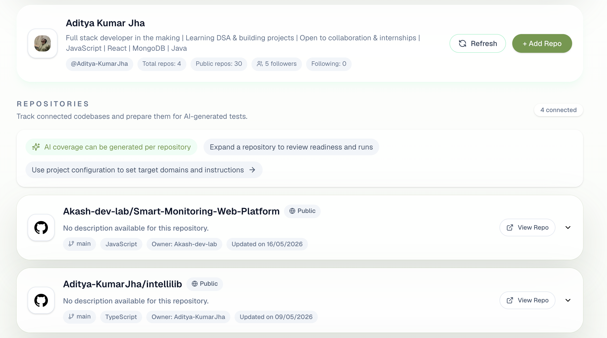
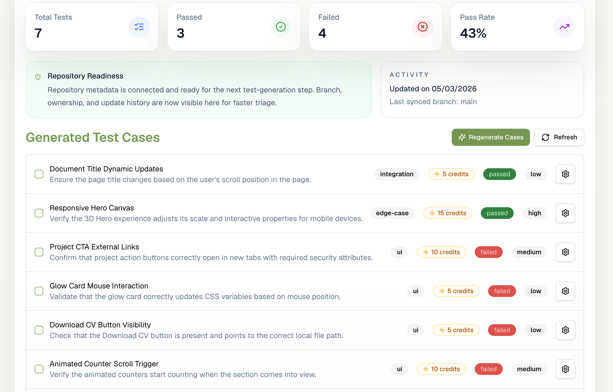

# Testly AI - Autonomous QA Automation Platform

<div align="center">



[](LICENSE)


**Testly AI is an AI-powered QA automation platform for GitHub repositories. It generates test cases from code context, runs them on cloud browsers, and delivers execution reports automatically.**

</div>

---

## Table of Contents

- [Overview](#overview)
- [Core Capabilities](#core-capabilities)
- [Demo Screenshots](#demo-screenshots)
- [Technology Stack](#technology-stack)
- [Architecture](#architecture)
- [Project Layout](#project-layout)
- [API Surface](#api-surface)
- [Database](#database)
- [Environment Variables](#environment-variables)
- [Local Setup](#local-setup)
- [Queue and Email Operations](#queue-and-email-operations)
- [Billing and Credits](#billing-and-credits)
- [Testing](#testing)
- [Deployment Notes](#deployment-notes)
- [License](#license)

---

## Overview

Testly AI is an end-to-end automation platform for QA teams and developers. It connects to GitHub repositories, analyzes code context, generates AI test cases, executes them through Browserbase + Playwright, and sends a rich execution report to the user.

The main workflow is:

1. Authenticate with GitHub and connect repositories.
2. Generate AI test cases from repo source code context.
3. Run tests in a cloud browser and capture logs.
4. Receive execution reports by email with PDF artifacts.

---

## Core Capabilities

### 1) GitHub Repository Intelligence

- OAuth-based GitHub connection.
- Repository discovery and selection.
- Targeted file analysis based on common Next.js/React structure.

### 2) AI Test Case Generation

- Gemini model generates structured test cases.
- Strict JSON schema enforcement with validation.
- Test routes and target files derived from repository context.

### 3) Cloud Execution

- Playwright execution on Browserbase.
- Script regeneration or cached execution mode.
- Live logs + session recording URL.

### 4) Credits and Payments

- Credit-based usage for generation and execution.
- Razorpay-powered checkout flow.
- Credits synchronized in workspace dashboard.

### 5) Automated Email Reports

- Welcome and payment confirmation emails.
- Execution reports with PDF attachment.
- Batch run consolidation into a single report.

---

## Demo Screenshots

All screenshots are available under `public/demo`.

### Landing


### Workspace



### Repository Overview



### Test Cases



### Execution UI



---

## Technology Stack

| Layer | Tech | Notes |
| --- | --- | --- |
| Frontend | Next.js, React, Tailwind CSS, Radix UI | App Router UI + shared components |
| Backend | Next.js Route Handlers, Drizzle ORM | API routes and DB access |
| Database | Neon Postgres | Serverless Postgres |
| Auth | Clerk | User auth and sessions |
| AI | Google Gemini | Test case + script generation |
| Browser Automation | Playwright, Browserbase | Cloud execution and sessions |
| Messaging | RabbitMQ | Email event queue |
| Email | Resend, pdf-lib | Transactional emails + PDF reports |
| Payments | Razorpay | Credits purchase flow |

### Frontend and App Layer

- Next.js App Router + TypeScript
- React 19
- Tailwind CSS + Radix UI
- Sonner for toasts

### Backend Services (Next.js APIs)

- Drizzle ORM with Neon Postgres
- Google Gemini (test generation + script generation)
- Browserbase + Playwright for cloud execution
- Clerk Authentication

### Messaging and Email

- RabbitMQ (queue)
- Resend (email delivery)
- PDF generation via `pdf-lib`

### Payments

- Razorpay order creation and verification

---

## Architecture

### High-Level Runtime Model

1. User connects GitHub and selects repos.
2. API fetches repo tree and file context.
3. Gemini generates test cases with strict JSON schema.
4. Tests are executed in Browserbase sessions.
5. Logs and results are persisted and emailed.

### Domain Components

- Identity: Clerk
- Repository Intelligence: GitHub APIs
- Test Generation: Gemini
- Execution: Browserbase + Playwright
- Billing: Razorpay
- Notifications: RabbitMQ + Resend

---

## Project Layout

```
app/
  api/
    generate-test-cases/    # AI test generation
    test-cases/             # List, run, and settings APIs
    github/                 # OAuth + GitHub data
    razorpay/               # Payment order + verification
    user-repo/              # Repo storage + settings
    users/                  # User creation + credit sync
  workspace/                # Main dashboard
components/
  landing/                  # Marketing site
  custom/                   # Workspace UI
  ui/                       # Shared UI primitives
context/                    # React context providers
db/                         # Drizzle schema + DB init
lib/                        # Helpers (env, api, rate limit, etc.)
public/
  demo/                     # README screenshots
```

---

## API Surface

| Domain | Route Prefix | Purpose |
|---|---|---|
| Test Generation | `/api/generate-test-cases` | Generate AI test cases |
| Test Execution | `/api/test-cases/run` | Execute a test case |
| Test Case Management | `/api/test-cases` | List test cases |
| Repo Management | `/api/user-repo` | Save repos and settings |
| GitHub | `/api/github/*` | OAuth + repo profile data |
| Payments | `/api/razorpay/*` | Order + verification |
| Users | `/api/users` | Create/load user and credits |

---

## Database

The schema is defined in [db/schema.ts](db/schema.ts) using Drizzle.

Main tables:

- `users` - account and credit storage
- `repositories` - connected repo metadata + settings
- `test_cases` - AI test case payloads, scripts, and run metadata

---

## Environment Variables

Copy `.env.example` and fill the required keys:

```bash
cp .env.example .env
```

Required variables include:

- `DATABASE_URL`
- `NEXT_PUBLIC_CLERK_PUBLISHABLE_KEY`
- `CLERK_SECRET_KEY`
- `GITHUB_CLIENT_ID`
- `GITHUB_CLIENT_SECRET`
- `GEMINI_API_KEY`
- `BROWSERBASE_PROJECT_ID`
- `BROWSERBASE_API_KEY`
- `RZP_KEY_ID`
- `RZP_KEY_SECRET`
- `RABBITMQ_URL`
- `RESEND_API_KEY`
- `RESEND_FROM`

---

## Local Setup

### 1) Clone the repository

```bash
git clone https://github.com/Aditya-KumarJha/Testly
```
```bash
cd Testly
```

### 2) Install

```bash
npm install
```

### 3) Configure environment

```bash
cp .env.example .env
```

### 4) Prepare database

```bash
npx drizzle-kit push
```

### 5) Run the app

```bash
npm run dev
```

App default: `http://localhost:3000`

---

## Queue and Email Operations

RabbitMQ is used for email event processing:

- `USER_LOGIN` -> welcome email
- `PAYMENT_CONFIRMED` -> receipt email
- `TEST_RUN_COMPLETED` -> execution report

In production, the consumer should run in a separate worker process.

---

## Billing and Credits

- Each generated test case consumes credits.
- Each execution consumes credits based on priority.
- Credits update after generation and execution.

---

## Testing

This project currently relies on runtime validations and QA runs. Add automated tests as the next step.

---

## Development Scripts

```bash
npm run dev        # Start dev server
npm run build      # Production build
npm run start      # Start production server
npm run lint       # Lint
npm run typecheck  # Type check
npm run db:generate
npm run db:push    # Same as: npx drizzle-kit push
npm run db:studio
```

---

## Deployment Notes

- Configure `.env` secrets in the hosting provider.
- Run RabbitMQ consumer separately in production.
- Use a persistent rate limiter for multi-instance deployments.

---

## License

MIT (see [LICENSE](LICENSE)).
